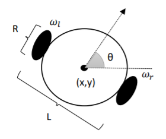

# Differetial-Drive
Routing of a mobile robot with differential drive
- The motion control of the robot is done over the angular velocity of the right and left wheels 𝜔𝑟 and 𝜔𝑙.
- 𝛿𝑡=0.1 seconds 
- Robot's initial pose, [0, 0, 0]  
- Wheel diameter R=0.1m and base L=0.3m  
• 0-10 second: 𝜔𝑟 = 10 𝑟𝑎𝑑/𝑠𝑒𝑐 ve 𝜔𝑙 = 10 𝑟𝑎𝑑/𝑠𝑒𝑐  
• 10-15 second: 𝜔𝑟 = 5 𝑟𝑎𝑑/𝑠𝑒𝑐 ve 𝜔𝑙 = 10 𝑟𝑎𝑑/𝑠𝑒𝑐   
• 15-20 second: 𝜔𝑟 = 10 𝑟𝑎𝑑/𝑠𝑒𝑐 ve 𝜔𝑙 = −10 𝑟𝑎𝑑/𝑠𝑒𝑐  
• 20-25 second: 𝜔𝑟 = 0 𝑟𝑎𝑑/𝑠𝑒𝑐 ve 𝜔𝑙 = 10 𝑟𝑎𝑑/𝑠𝑒c  

